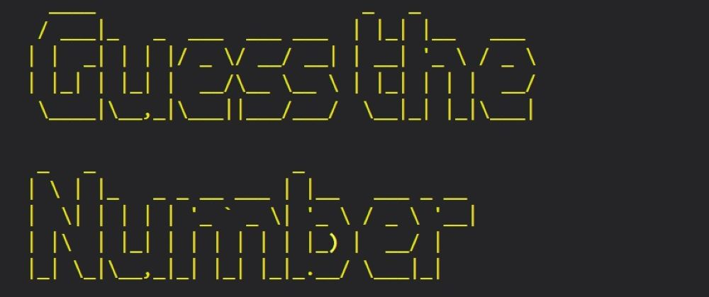

# <mark>Number Guessing Game - Project 3: Python Essentials</mark>

 Guess the Number is an interactive command-line application in Python. The program is generating a number between 1 and 10, push data and pull data from a user input.

The main purpose of my project was to create a mini-game in Python that interacts with the user. A short program with conditional branches, loops, inputs, modules, library meant to create a functional but also interactive application.

***
## Content
***

* **[Scope](#scope)**

* **[Features](#features)**

* **[Technologies](#technologies)**

* **[Testing](#testing)**

* **[Bugs](#bugs)**

* **[Deployment](#deployment)**

* **[Credits](#credits)**

***
## Scope
*** 

### **Application Overview**

The aim of Guessing Numbers game in Python is the user to guess the number that the program is generating randomly.

The logic steps of the program are:
  * A random number between 1 and 10 is generated by the app.
  * The player enters his first guess.
  * The program checks if the number is equal and if so the player wins.
  * If the player's number and the random number are not equal a hint is provided to the user to guess again, with a message with the input number being too low or too high.
  * The test is repeated three times, every time providing hints. 
  * If the player runs out of attempts the program displays a 'Play again' option.

### **User goals**

  * User is encouraged right from the start to interact with the program. 
  * The rules of the game are clearly displayed in the greeting message.
  * The game is simple but exciting because the user will need to guess the number in three attempts.
  * User is helped with hints to guess the application's number.
  * User is notified if the input has any errors, with a print of the error and repeat the input step.
  * When the game is finished the user have the option to guess a new number by pressing 'y'. This way repeating unnecessary steps are avoided and the user remains in the game.
  * User will find a very easy, interacting and enjoyable mini-game, suitable for children and adults.

***
## Features
***

### **Welcome Screen**

  * For a typing effect I have used sys and time module to offer a better user experience.
  * I ensured the time sleep is not too slow or too fast, in the way that the message is properly displayed for the player but still having a visible animated text.
  * ASCII art font for the title of my program was created to enhance again the user experience by the overall look of a retro mini-game.
  * A name input is required to display the welcome message for a personal touch.

### **The game**

  * I have used Colorama module to get coloured text in the terminal.
  * A good-bye message is displayed when the user decides to exit the game.

### **Inside the program**

  * The full game is based only on functions to make the program easier to read and to allow me an easier debugging.  
  * Overall there are six functions:
    * Typewriting effect.
    * Intro of the game with the player's input name and the rules of the game.
    * Generating a random number between 1 and 10, input number from the user, compare the numbers. A while loop will run three times the user's input numbers and display hints.
    * Validating the input to be a number and to have a value between 1 and 10. 
    * Play again with option yes or exit. Having this option we can repeat the game without running the program from the beginning, just from generating another random number and all the rest that follows after.
    * At the end is the main function which runs the main program.

***
## Technologies 
***

### **Language used**

  * Pyhton

### **Diagramming application**

  * Lucid app - to generate my flowchart

### **Libraries and modules** 

  * Random module: 

    * Needed to generate the random number. 

  * Sys and Time modules:
    
    * Used for the typing effect when printing the welcome and goodbye messages for better visual. 

  * Pyfiglet module:  
    
    * Used to covert the title text into ASCII art font.

  * Colorama module: 
    
    * Used to print colored text in the terminal.

***
## Testing
***

  * With the pep8 validator still not working I have used the recommended replacement [pep8 CI heroku app](https://pep8ci.herokuapp.com/). The test showed no errors found. &check; 

  

  * Checked that the validation function is working properly if the user's input is not a number so it would display an error message and return the input request to the user. &check;

  * Checked that the validation function works for any numbers out of range 1 and 10. &check;
  
  

***
## Bugs
***

  * First problem encountered was the validation function for the input number, giving the full errors before my custom error message.
    * Bug solved by moving the function right after the input number. With boolean logic I was able to continue the game in case the input was invalid.

  * The loop to count three tries wasn't working properly if the player would guess the number from the first or second try. Play_again function would not be called right after the guess was right.
    * Bug solved when I added a break statement if the number was guessed.

  * The pep8 validator showed an error on 'import sys, time' modules.
    * Importing them separately resolved this issue (best practice is to have one import per line).

  * Rich library didn't work in Heroku. I followed the steps to install the dependencies on heroku but Rich didn't show up in my requirements.txt.  
    * During my research I was reading about colorama module as well so was easier to use it instead and didn't got stuck in solving that small issue as it wasn't a big part of my project.

  * No unsolved bugs. 

***
## Deployment
***

Prior the deployment on Heroku I install the dependecies for deployment, with the code pip3 freeze > requirements.txt.
The program was deployed through Heroku following the steps:
  * Create a Heroku account using Eco Dynos Plan.
  * In Heroku's Settings I add a Config Var with Key: PORT and Value:8000.
  * The first buildpack added was Python followed by node.js.
  * Deployment method is GitHub.

The live link is [guess](https://guess.herokuapp.com/).

***
## Credits
***

  * The Python template was provided by [Code Institute](https://github.com/Code-Institute-Org/python-essentials-template).
  * Typing effect function is from [Stack Community](https://stackoverflow.com/questions/20302331/typing-effect-in-python) with just a few changes to customize it as I wanted. 
  * An inspiration for pyfiglet module was [Geeks for Geeks](https://geeksforgeeks.org/).
  * The rich library was brought to my attention by [@Patloeber](https://www.youtube.com/@patloeber). Unfortunately, it didn't work in Heroku.
  * The colorama module from [Stack Community](https://stackoverflow.com/questions/61686780/python-colorama-print-all-colors).